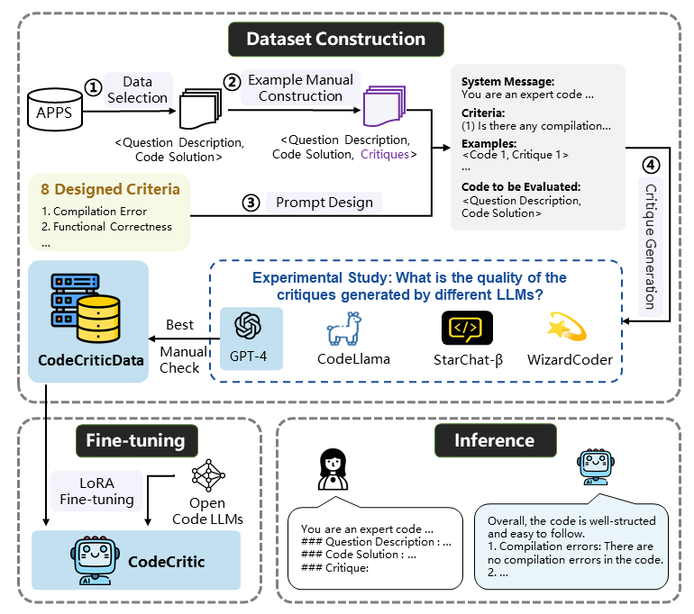

# Towards Effective Code Quality Evaluation with Large Language Models: An Experimental Study and Beyond

We conduct an extensive experimental study to explore the potential of LLMs for comprehensively evaluating generated code. We then propose a novel approach for code quality evaluation using LLMs.



Our contributions can be summarized as follows:

* We construct a high-quality open-source critique dataset CoQualEval with eight-dimensional critiques on code quality including correctness, efficiency, and readability.

* We present CoQuaLlama, a novel approach for code quality evaluation using large language models, which can generate useful critiques on code quality and help code optimization.

* We conduct extensive experiments including human evaluation to verify the effectiveness of CoQuaLlama. We also experiment with five programming languages and reveal the cross-language generalizability of CoQuaLlama.


## Source code 
### Environment
```
conda create -n CoQual python=3.10.13
conda activate CoQual

# CUDA 11.7
pip install torch==2.0.1 torchvision==0.15.2 torchaudio==2.0.2

# transformers 4.34.1
pip install transformers==4.34.1

# peft 0.6.2
pip install peft==0.6.2

# bitsandbytes 0.42.0
pip install bitsandbytes==0.42.0

pip install accelerate==0.24.1 appdirs==1.4.4 loralib==0.1.2 black==23.11.0 datasets==2.14.6 fire==0.5.0 sentencepiece==0.1.99 jsonlines==4.0.0
 
```

### Data

```
cd dataset
```

Data statistic is shown in this Table. 

| Train | Test  | 
| :------: | :----: |
|  1,274  | 8,392  | 


#### Fine-tuning


```
python finetune.py \
--base_model '../CodeLlama-7b-Instruct-hf' \
--data_path '../dataset/train.jsonl' \
--output_dir '../output' \
--batch_size 256 \
--micro_batch_size 16 \
--num_epochs 2 \
--val_set_size 0.1

```
#### Reference

```
python inference.py \
--load_8bit \
--base_model '../CodeLlama-7b-Instruct-hf' \
--lora_weights '../output'
 
```

## Appendix

The exemplary critiques, direct scoring and pairwise comparison prompt using GPT-4, and the optimized code obtained using the critiques generated by different models are shown in `Appendix/Appendix.pdf`. 

